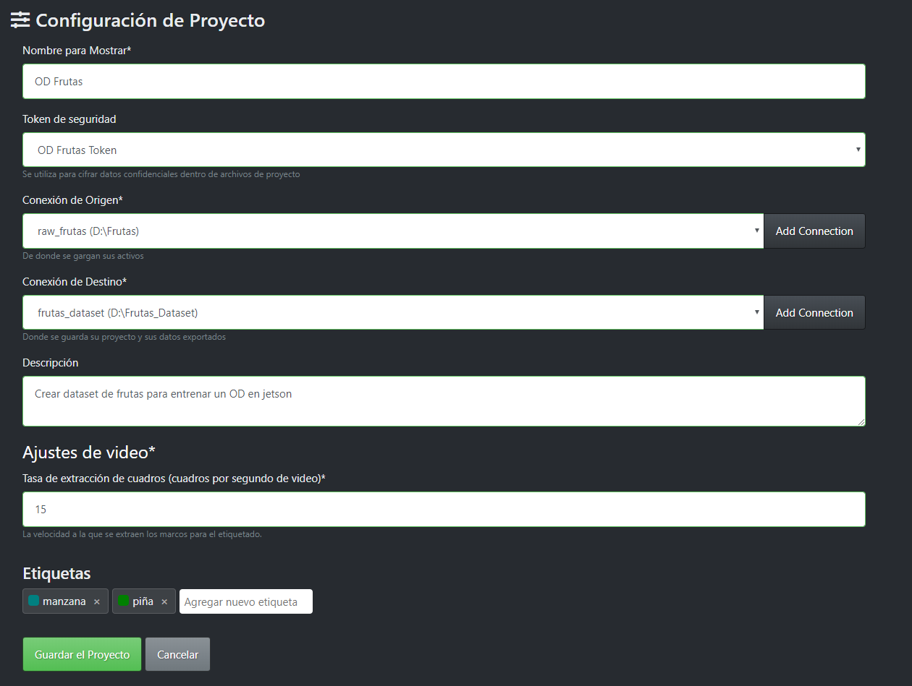

# Fruits detection
This repository present a fruit detection model using a neural network. The aim is to build small scale dataset of two fruits, apples and pineapples, then using a third software to apply data augmentation and finally using transfer learning to implement a object detection algorithm in a Jetson Nano.
## Install VoTT
- Dowload the exe file from Microsoft VoTT github repository [here](https://github.com/Microsoft/VoTT/releases).
- Execute the downloaded file
- Installation will start automatically
## Crate a project in VoTT
- Open the app and go to the home page
- Click on "New Project"
- Choose a name for your new project
- For security token choose "Generate New Security Token"
- In origin connection, click on 'Add Connection', choose a name, a description if you want and select in provider "System local files", select the path were you saved your images.
- In destination connection, do the same but now chose a diferent path, were you want to export your dataset
- Then, add a informative description.
- Leave in 15 the frames per second
- Finally, add the tags names and save the project.

## Create our dataset
- Let's found al least 30 images for each class. 30 apples and 30 pineaple
- It's important to found images from diferents perspectives and with other objects to have a rich dataset.

- I save the images with numbers, example 001, 002 and 003
## Label our images 
- [Here](https://blog.roboflow.com/tips-for-how-to-label-images/) are some tips to correctly label our images

## Data augmentation
- Sign in with your acccount of [roboflow](https://roboflow.com/)
- Upload your dataset to your new project in roboflow
- Apply data augmentation techniques
- Create your dataset
- Download the new dataset in Pascal voc format
- [Here](https://drive.google.com/drive/folders/1RgfVvaq2wzZmYM6PVujfd7wZ6Ak4nB2Y?usp=sharing) is the datataset ready.
## Train the mobilenet ssd neural network
- Fisrt download this [file](https://drive.google.com/u/0/uc?id=1rKiFl4WwzcbQ4Qbs_y4MbU9IGI3dfzLS&export=download) and install the requirements file
- In the data folder you will move the dataset from roboflow
- Unzip your data, it should look like this.

- Open your anaconda prompt and go the path of the python script 'PrepareDataset.py' in pytorch/data
- Enter this command into the console:

`$ python PrepareDataset.py --data=Fruits --name=FruitsDataset`
- Now open a new anacconda prompt and go to the path pytorch-ssd folder and enter this command into the console:

`$ python train_ssd.py --dataset-type=voc --data=data/FruitsDataset --model-dir=models/FruitsModel --batch-size=8 --workers=0 --epochs=10`

- Finally, let's transform our model to ONNX format, this will optimize our model. In the same console we train the model, we will put this command:

`$ python onnx_export.py --model-dir=models/FruitsModel`

- Perfect, now save the .onnx  and the labels.txt file created in google Drive and download in your Jetson Nano.
## Running the model in your Jetson Nano
* Download your model.onnx and the labels.txt to /jetson-inference/python/training/detection/ssd/models/FruitsModel/
* Run the docker container in the terminal

`$ cd jetson-inference`
`$ docker/run.sh`
* Then go to the training directory

`$ cd python/training/detection/ssd/`
* Run your model using the webcam 

`$ detectnet --model=models/FruitsModels/fruits.onnx --labels=models/FruitsModels//labels.txt --input-blob=input_0 --output-cvg=scores --output-bbox=boxes /dev/video0`
* The first time you run your model it will take a while

## Prepare Jetson Nano to start running Deep Learning models 
[Here](https://github.com/LuisAngelFonseca-IMT/JetsonNANOCustomDataset/blob/main/README.md)
