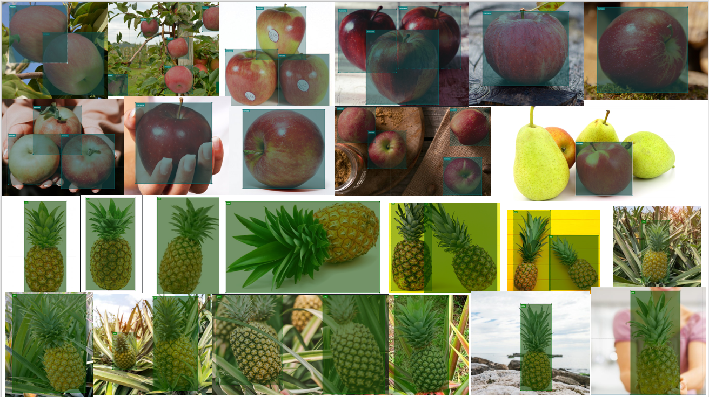

# Fruits_detection
This repository present a fruit detection model using a neural network. The aim is to build small scale dataset of two fruits, apples and pineapples, then using a third software to apply data augmentation and finally using transfer learning to implement a object detection algorithm in a Jetson Nano.
## Create our dataset
- Let's found al least 30 images for each class. 30 apples and 30 pineaple
- It's important to found images from diferents perspectives and with others object to have a rich dataset.

- I save the images with numbers, example 001, 002 and 003
## Label our images 
- Download the Vott repository [here](https://github.com/microsoft/VoTT)
- In the github repository are al the instruction to use the application
- Start a new project and start labeling the images.
- [Here](https://blog.roboflow.com/tips-for-how-to-label-images/) are some tips to correctly labels our images

